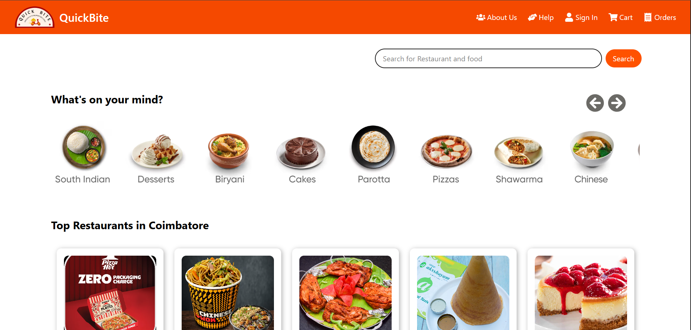

# 🍔 QuickBite

QuickBite is a responsive food delivery web application built with **React.js**, **Redux Toolkit**, and **React Router**. It allows users to browse restaurants, view menus, add items to their cart, manage delivery addresses, complete payments, and place orders through a simple and modern interface.

---

## 🌐 Live Demo

🔗**Link:** **https://quick-bite-food-delivery-app-tau.vercel.app/**

---

## 📸 Preview


[](https://quick-bite-food-delivery-app-tau.vercel.app/)

---

## 📁 Project Structure

```
QuickBite/
│
├── public/
│
├── src/
│   │
│   ├── assets/
│   │   ├── Error.png
│   │   ├── QuickBite.png
│   │   ├── mockData.js
│   │   └── resMockData.js
│   │
│   ├── components/
│   │   ├── About-Us.jsx
│   │   ├── Address.jsx
│   │   ├── App.jsx
│   │   ├── Body.jsx
│   │   ├── Cart.jsx
│   │   ├── Error.jsx
│   │   ├── Footer.jsx
│   │   ├── Header.jsx
│   │   ├── Help.jsx
│   │   ├── MenuShimmer.jsx
│   │   ├── Offers.jsx
│   │   ├── OrderSuccess.jsx
│   │   ├── Payment.jsx
│   │   ├── RestaurantMenu.jsx
│   │   ├── Restaurants.jsx
│   │   ├── Shimmer.jsx
│   │   └── SignIn.jsx
│   │
│   ├── Constants/
│   │   ├── AddressSlice.jsx
│   │   ├── AppSlice.jsx
│   │   ├── AppStore.jsx
│   │   ├── OrderSlice.jsx
│   │   └── PaymentSlice.jsx
│   │
│   ├── index.css
│   └── main.jsx
│
├── index.html
├── package.json
├── package-lock.json
├── vite.config.js
├── eslint.config.js
└── README.md
```

---

# ✨ Features

- 🍕 Browse restaurants
- 📜 View restaurant menus
- 🔍 Search restaurants
- 🛒 Add and remove food items from cart
- 📍 Manage delivery address
- 💳 Payment page
- ✅ Order confirmation page
- 👤 User Sign In
- 🎁 Offers page
- ❓ Help & About pages
- ⚡ Loading shimmer UI
- 📱 Responsive design

---

# 🛠 Tech Stack

- React.js
- Vite
- Redux Toolkit
- React Router DOM
- JavaScript (ES6+)
- CSS3
- HTML5

---

# 📦 Installation

Clone the repository

```bash
git clone https://github.com/Preethigajeganathan/QuickBite-food-delivery-App.git
```

Move into the project folder

```bash
cd QuickBite
```

Install dependencies

```bash
npm install
```

---

# ▶️ Run the Project

Start the development server

```bash
npm run dev
```

The application will run on

```
http://localhost:5173
```

---

# 📂 Components

| Component | Description |
|------------|-------------|
| Header | Navigation bar |
| Body | Home page |
| Restaurants | Displays restaurant list |
| RestaurantMenu | Shows menu of selected restaurant |
| Cart | Shopping cart |
| Payment | Payment page |
| Address | Delivery address page |
| OrderSuccess | Order confirmation page |
| SignIn | User login page |
| About-Us | About application |
| Help | Help & Support |
| Footer | Footer section |
| Error | Error page |
| Shimmer | Loading animation |

---

# 🗂 Redux Store

The application uses Redux Toolkit for state management.

### Store Files

- AppStore.jsx
- AppSlice.jsx
- AddressSlice.jsx
- OrderSlice.jsx
- PaymentSlice.jsx

---

# 🚀 Future Improvements

- User Authentication API
- Real Payment Gateway Integration
- Live Order Tracking
- Wishlist
- Favorites
- Restaurant Ratings
- Dark Mode
- Firebase Authentication
- Backend Integration
- Push Notifications

---

# 👨‍💻 Developed By

**Preethiga**

---

# 📄 License

This project is licensed under the MIT License.

---

⭐ If you like this project, consider giving it a star on GitHub!